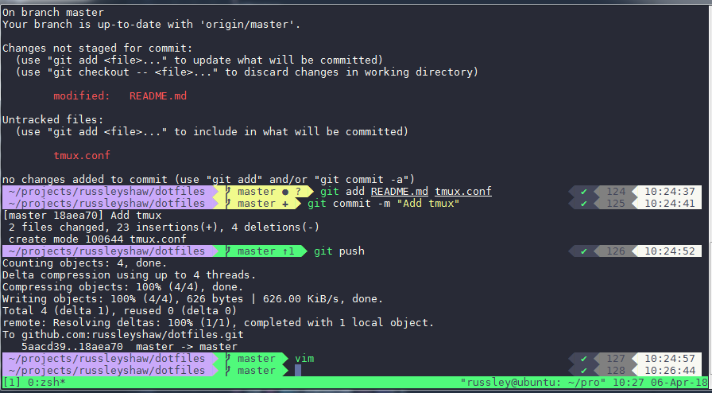

# Russley's Dotfiles

My dotfiles for SSH'd development.



## Installing

- Install zsh, vim, tmux
- [Install Powerline Fonts](https://github.com/powerline/fonts/archive/master.zip)
- [Install Dracula Theme](https://gist.github.com/russleyshaw/4ce43f3b3c0d68ac67fe69eb3a375a4d)

```bash
./install.sh
```

## Updating

```bash
./update.sh
```

## Yarn
```bash
curl -o- -L https://yarnpkg.com/install.sh | bash
```

## NVM
```bash
mkdir ~/.nvm
curl -o- https://raw.githubusercontent.com/creationix/nvm/v0.33.11/install.sh | bash
```
